# Mermaid 图表语法参考

## 基础语法规则

所有 Mermaid 图表必须包裹在 ` ```mermaid ` 和 ` ``` ` 代码块中。图表中的文字必须使用中文。

## 1. 流程图 (flowchart)

适用于展示业务流程、工作流程、决策树等。

### 基础流程图
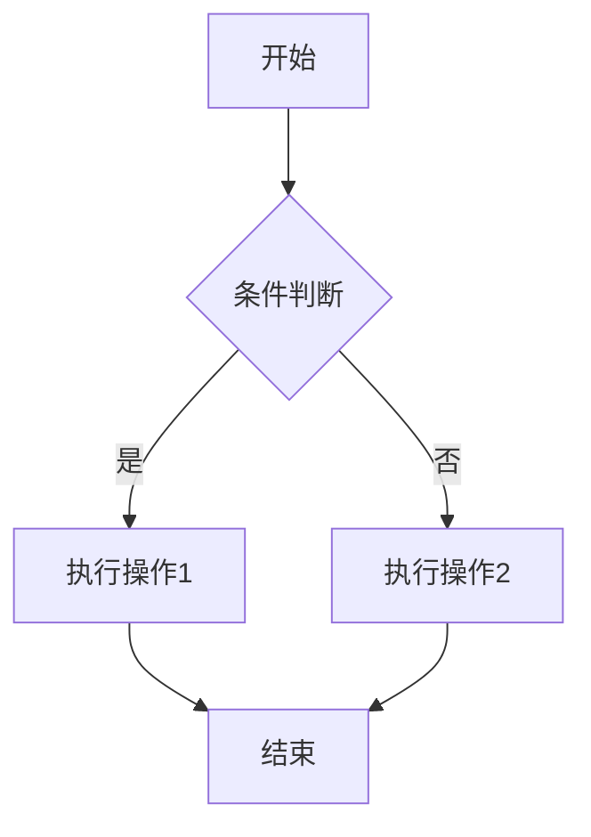
```mermaid
flowchart TD
    A[开始] --> B{条件判断}
    B -->|是| C[执行操作1]
    B -->|否| D[执行操作2]
    C --> E[结束]
    D --> E
```

### 带子图的流程图
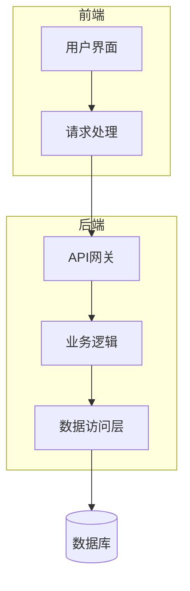
```mermaid
flowchart TD
    subgraph 前端
        A[用户界面] --> B[请求处理]
    end
    subgraph 后端
        C[API网关] --> D[业务逻辑]
        D --> E[数据访问层]
    end
    B --> C
    E --> F[(数据库)]
```

### 布局方向
- `TD` 或 `TB`：自上而下（默认）
- `LR`：从左到右
- `BT`：自下而上
- `RL`：从右到左

### 节点形状
- `id[文本]`：矩形（流程节点）
- `id(文本)`：圆角矩形
- `id{文本}`：菱形（判断节点）
- `id((文本))`：圆形（起止节点）
- `id[[文本]]`：子程序
- `id[(文本)]`：数据库形状
- `id>文本]`：旗形
- `id{{文本}}`：六边形
- `id[/文本/]`：平行四边形

### 连线类型
- `A --> B`：实线箭头
- `A --- B`：实线无箭头
- `A -.-> B`：虚线箭头
- `A ==> B`：粗线箭头
- `A --文本--> B`：带文字的连线
- `A -->|文本| B`：带文字的连线（另一种写法）

## 2. 时序图 (sequenceDiagram)

适用于展示对象间的交互、消息传递、API调用流程等。

### 基础时序图
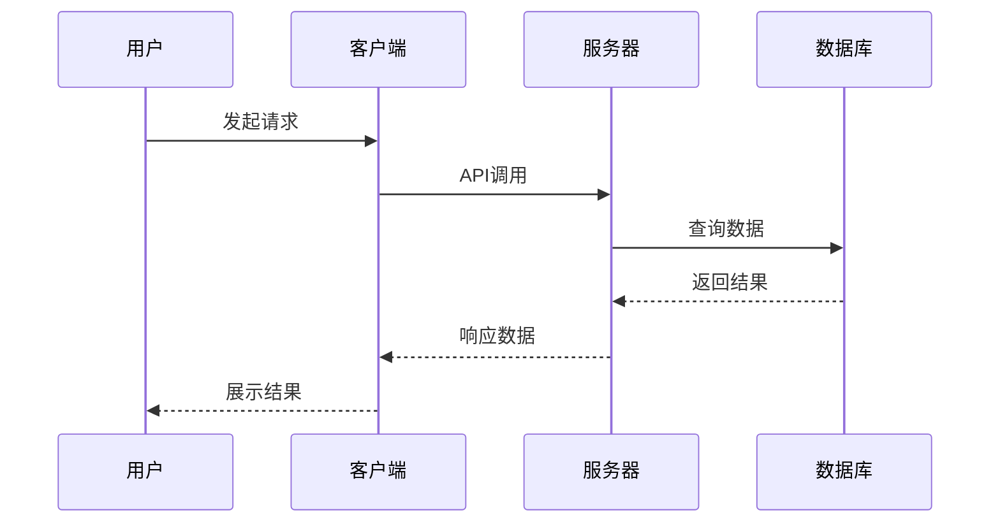
```mermaid
sequenceDiagram
    participant 用户
    participant 客户端
    participant 服务器
    participant 数据库

    用户->>客户端: 发起请求
    客户端->>服务器: API调用
    服务器->>数据库: 查询数据
    数据库-->>服务器: 返回结果
    服务器-->>客户端: 响应数据
    客户端-->>用户: 展示结果
```

### 带高级特性的时序图
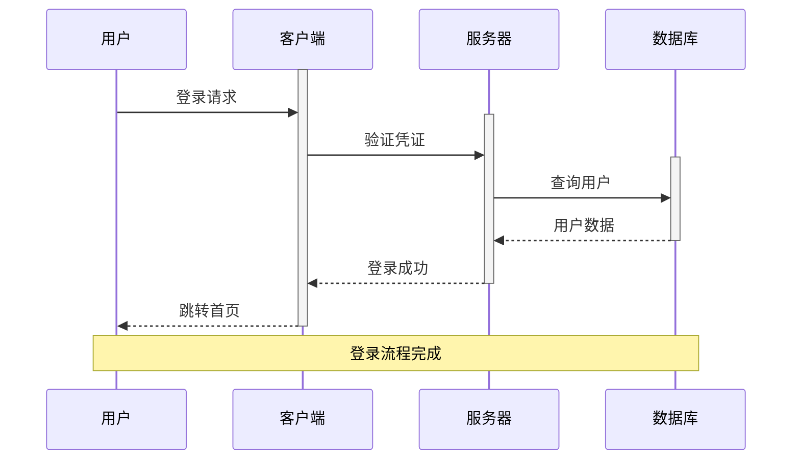
```mermaid
sequenceDiagram
    participant 用户
    participant 客户端
    participant 服务器
    participant 数据库

    activate 客户端
    用户->>客户端: 登录请求
    activate 服务器
    客户端->>服务器: 验证凭证
    activate 数据库
    服务器->>数据库: 查询用户
    数据库-->>服务器: 用户数据
    deactivate 数据库
    服务器-->>客户端: 登录成功
    deactivate 服务器
    客户端-->>用户: 跳转首页
    deactivate 客户端

    Note over 用户,数据库: 登录流程完成
```

### 消息类型
- `A->>B`：实线箭头（请求）
- `A-->>B`：虚线箭头（响应）
- `A--xB`：实线箭头带X（失败）
- `A-x B`：虚线箭头带X（异步失败）

### 高级特性
- `activate A` / `deactivate A`：激活/取消激活参与者
- `Note over A,B: 文本`：添加跨参与者注释
- `Note right of A: 文本`：在参与者右侧添加注释
- `loop 条件 ... end`：循环
- `alt 条件 ... else 条件 ... end`：条件分支
- `opt 条件 ... end`：可选执行

## 3. 类图 (classDiagram)

适用于展示类结构、继承关系、面向对象设计。

### 基础类图
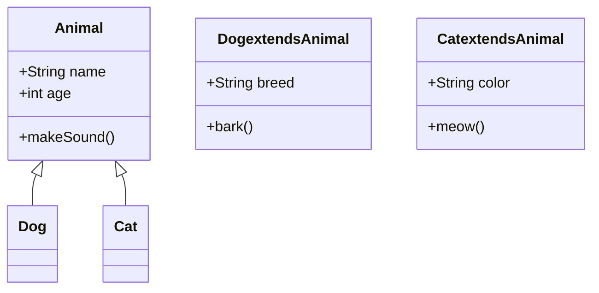
```mermaid
classDiagram
    class Animal {
        +String name
        +int age
        +makeSound()
    }
    class Dog extends Animal {
        +String breed
        +bark()
    }
    class Cat extends Animal {
        +String color
        +meow()
    }

    Animal <|-- Dog
    Animal <|-- Cat
```

### 带关系的类图
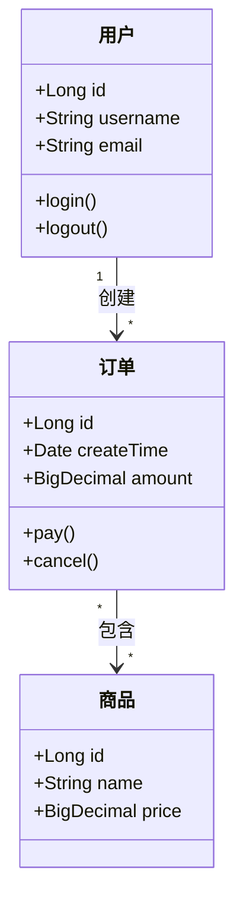
```mermaid
classDiagram
    class 用户 {
        +Long id
        +String username
        +String email
        +login()
        +logout()
    }
    class 订单 {
        +Long id
        +Date createTime
        +BigDecimal amount
        +pay()
        +cancel()
    }
    class 商品 {
        +Long id
        +String name
        +BigDecimal price
    }

    用户 "1" --> "*" 订单 : 创建
    订单 "*" --> "*" 商品 : 包含
```

### 关系类型
- `<|--`：继承
- `*--`：组合
- `o--`：聚合
- `-->`：关联
- `--`：实线链接
- `..>`：依赖
- `..|>`：实现
- `..`：虚线链接

### 可见性
- `+`：public
- `-`：private
- `#`：protected
- `~`：package/internal

## 4. 状态图 (stateDiagram-v2)

适用于展示状态转换、生命周期等。

### 基础状态图
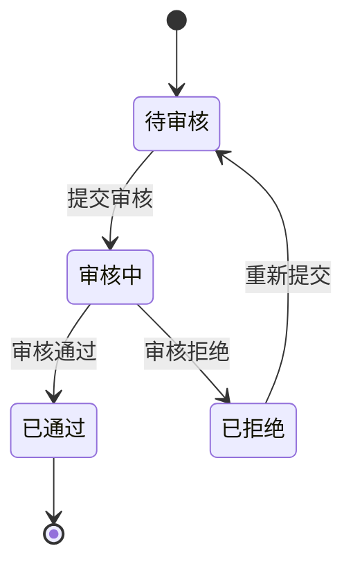
```mermaid
stateDiagram-v2
    [*] --> 待审核
    待审核 --> 审核中: 提交审核
    审核中 --> 已通过: 审核通过
    审核中 --> 已拒绝: 审核拒绝
    已拒绝 --> 待审核: 重新提交
    已通过 --> [*]
```

### 带嵌套状态的复杂状态图
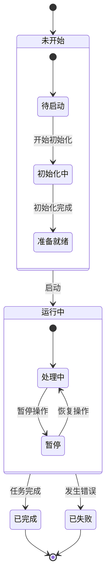
```mermaid
stateDiagram-v2
    [*] --> 未开始

    state 未开始 {
        [*] --> 待启动
        待启动 --> 初始化中: 开始初始化
        初始化中 --> 准备就绪: 初始化完成
    }

    state 运行中 {
        [*] --> 处理中
        处理中 --> 暂停: 暂停操作
        暂停 --> 处理中: 恢复操作
    }

    未开始 --> 运行中: 启动
    运行中 --> 已完成: 任务完成
    运行中 --> 已失败: 发生错误
    已完成 --> [*]
    已失败 --> [*]
```

### 状态图特性
- `[*]`：开始/结束状态
- `状态A --> 状态B: 触发条件`：状态转换
- `state 状态名 {...}`：嵌套状态
- `note right of 状态名: 注释`：添加注释

## 5. 实体关系图 (erDiagram)

适用于展示实体关系、数据库设计。

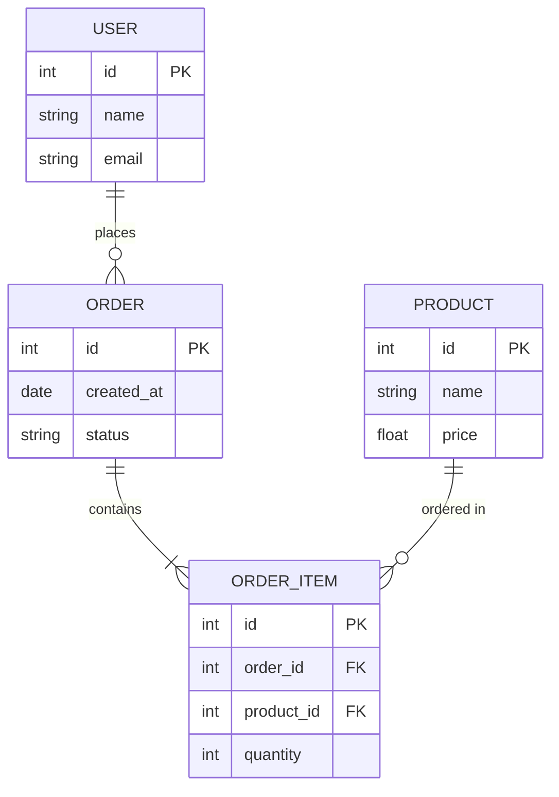
```mermaid
erDiagram
    USER ||--o{ ORDER : places
    ORDER ||--|{ ORDER_ITEM : contains
    PRODUCT ||--o{ ORDER_ITEM : "ordered in"

    USER {
        int id PK
        string name
        string email
    }
    ORDER {
        int id PK
        date created_at
        string status
    }
    PRODUCT {
        int id PK
        string name
        float price
    }
    ORDER_ITEM {
        int id PK
        int order_id FK
        int product_id FK
        int quantity
    }
```

### 关系基数
- `||--||`：一对一
- `||--o{`：一对多（0或多）
- `||--|{`：一对多（1或多）
- `}o--o{`：多对多
- `}o--||`：多对一

### 属性标记
- `PK`：主键
- `FK`：外键
- `UK`：唯一键

## 6. 甘特图 (gantt)

适用于展示项目计划、时间安排、里程碑等。

### 基础甘特图
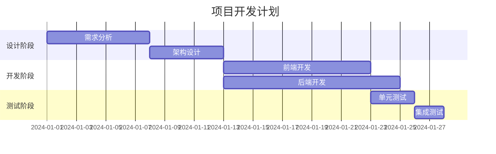
```mermaid
gantt
    title 项目开发计划
    dateFormat YYYY-MM-DD
    section 设计阶段
    需求分析 :a1, 2024-01-01, 7d
    架构设计 :a2, after a1, 5d
    section 开发阶段
    前端开发 :b1, after a2, 10d
    后端开发 :b2, after a2, 12d
    section 测试阶段
    单元测试 :c1, after b1, 3d
    集成测试 :c2, after c1, 2d
```

### 带里程碑和状态甘特图
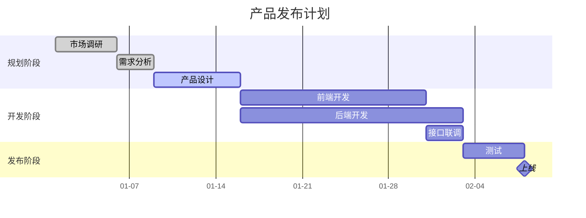
```mermaid
gantt
    title 产品发布计划
    dateFormat YYYY-MM-DD
    axisFormat %m-%d

    section 规划阶段
    市场调研 :done, a1, 2024-01-01, 5d
    需求分析 :done, a2, after a1, 3d
    产品设计 :active, a3, after a2, 7d

    section 开发阶段
    前端开发 :b1, after a3, 15d
    后端开发 :b2, after a3, 18d
    接口联调 :b3, after b1, 3d

    section 发布阶段
    测试 :c1, after b3, 5d
    上线 :milestone, c2, after c1, 0d
```

### 任务状态
- `done`：已完成
- `active`：进行中
- `crit`：关键任务
- `milestone`：里程碑（0d）

### 任务依赖
- `after a1`：在任务a1之后开始
- `a1, 2024-01-01, 7d`：任务ID、开始时间、持续时间

## 7. 饼图 (pie)

适用于展示数据占比、百分比分析。

### 基础饼图
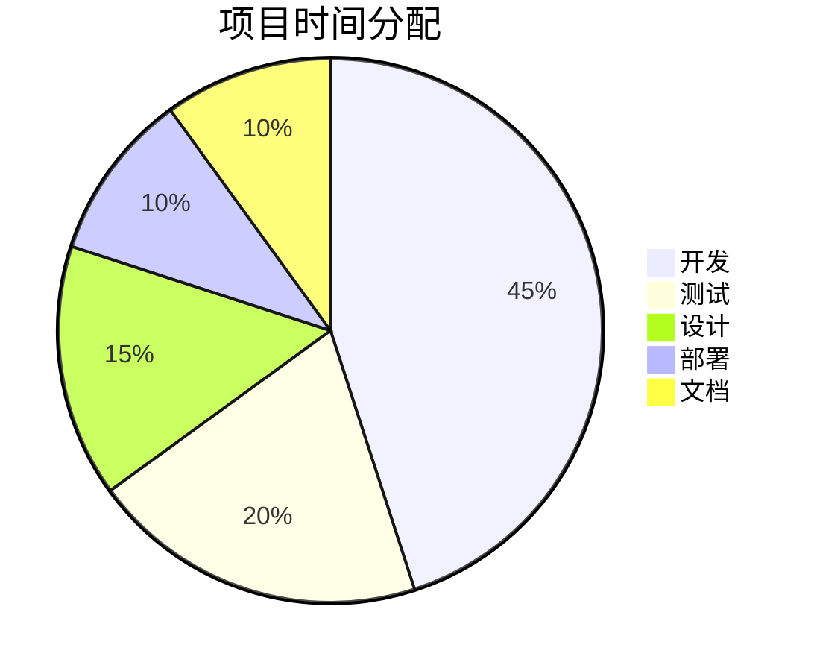
```mermaid
pie title 项目时间分配
    "开发" : 45
    "测试" : 20
    "设计" : 15
    "部署" : 10
    "文档" : 10
```

### 带百分比的饼图
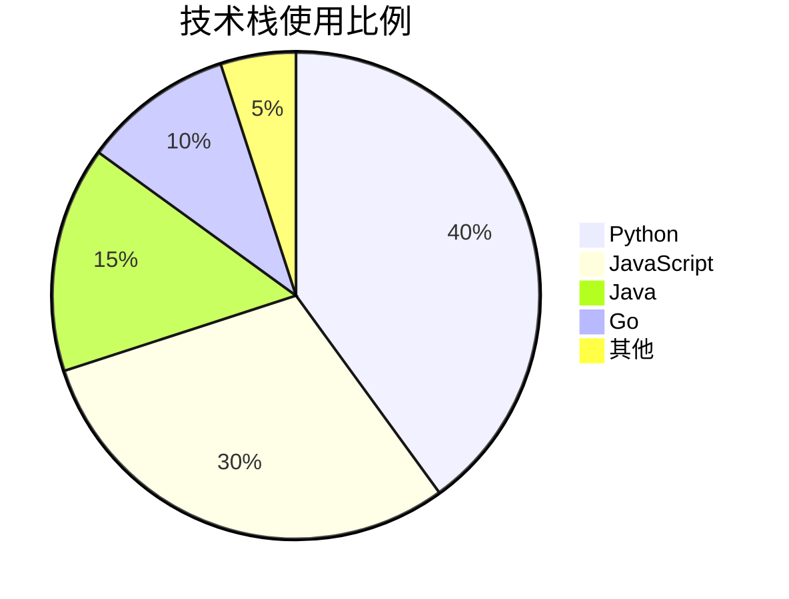
```mermaid
pie title 技术栈使用比例
    "Python" : 40
    "JavaScript" : 30
    "Java" : 15
    "Go" : 10
    "其他" : 5
```

## 8. 思维导图 (mindmap)

适用于展示知识结构、层级关系。

### 基础思维导图
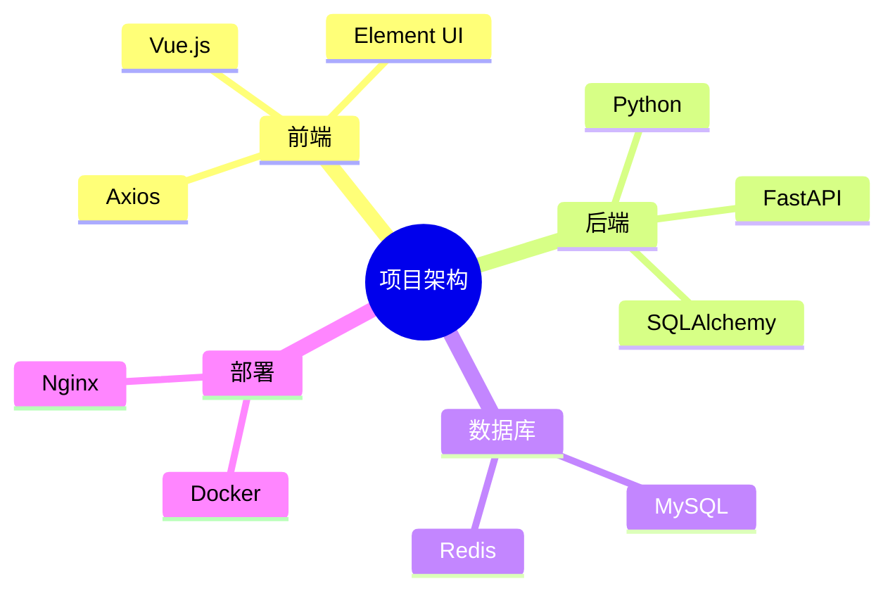
```mermaid
mindmap
  root((项目架构))
    前端
      Vue.js
      Element UI
      Axios
    后端
      Python
      FastAPI
      SQLAlchemy
    数据库
      MySQL
      Redis
    部署
      Docker
      Nginx
```

### 带不同节点形状的思维导图
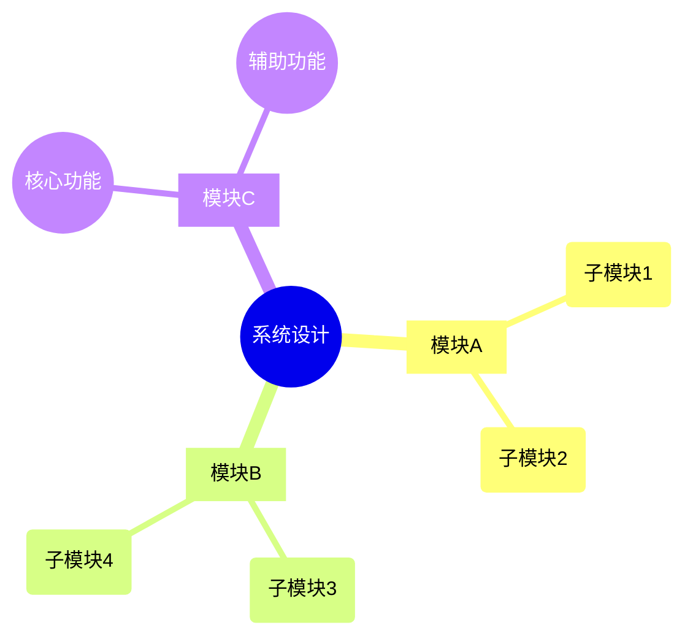
```mermaid
mindmap
  root((系统设计))
    [模块A]
      (子模块1)
      (子模块2)
    [模块B]
      (子模块3)
        ::icon(fa fa-book)
      (子模块4)
    [模块C]
      ((核心功能))
      ((辅助功能))
```

### 节点形状
- `((文本))`：圆形（根节点）
- `[文本]`：矩形
- `(文本)`：圆角矩形
- `文本`：默认形状

## 9. 用户旅程图 (journey)

适用于展示用户体验旅程、用户操作路径等。

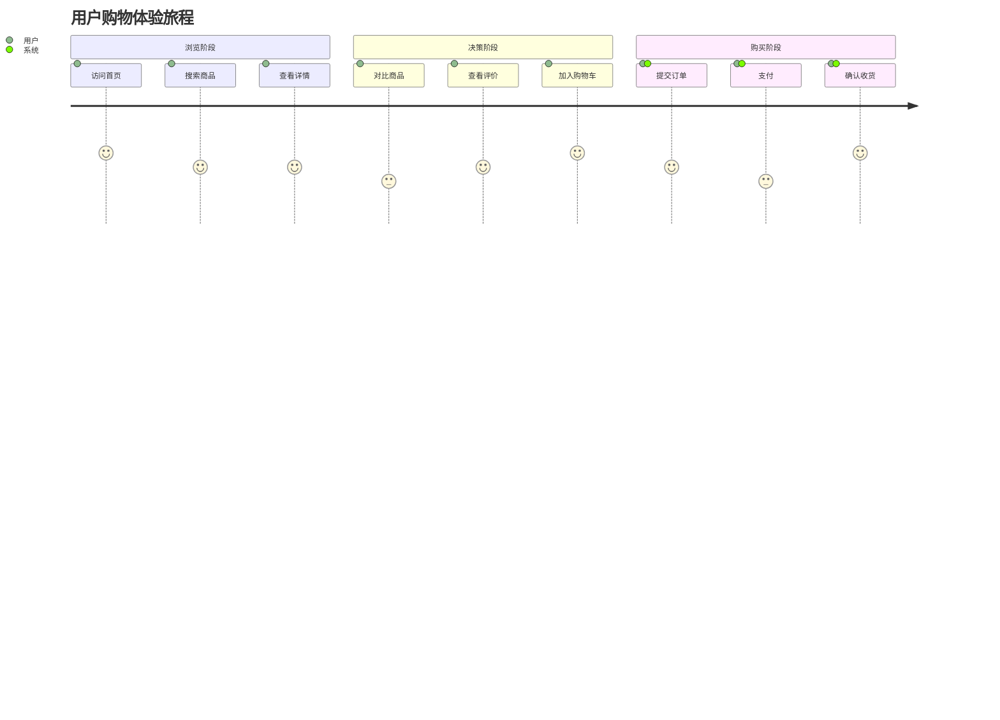
```mermaid
journey
    title 用户购物体验旅程
    section 浏览阶段
        访问首页: 5: 用户
        搜索商品: 4: 用户
        查看详情: 4: 用户
    section 决策阶段
        对比商品: 3: 用户
        查看评价: 4: 用户
        加入购物车: 5: 用户
    section 购买阶段
        提交订单: 4: 用户, 系统
        支付: 3: 用户, 系统
        确认收货: 5: 用户, 系统
```

### 旅程图说明
- `title`：旅程标题
- `section`：阶段划分
- `任务名: 分数: 参与者`：分数1-5表示满意度，多个参与者用逗号分隔

## 10. Git图 (gitGraph)

适用于展示Git分支、提交历史、合并流程等。

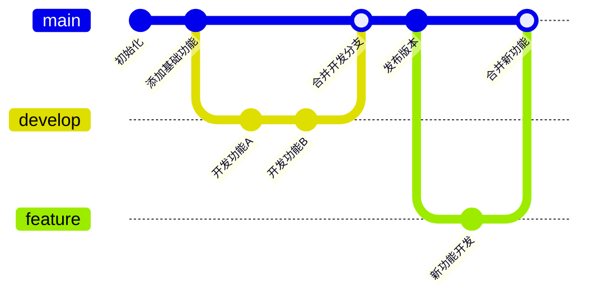
```mermaid
gitGraph
    commit id: "初始化"
    commit id: "添加基础功能"
    branch develop
    checkout develop
    commit id: "开发功能A"
    commit id: "开发功能B"
    checkout main
    merge develop id: "合并开发分支"
    commit id: "发布版本"
    branch feature
    checkout feature
    commit id: "新功能开发"
    checkout main
    merge feature id: "合并新功能"
```

### Git图命令
- `commit id: "提交信息"`：提交
- `branch 分支名`：创建分支
- `checkout 分支名`：切换分支
- `merge 分支名 id: "合并信息"`：合并分支

## 11. XY图表 (xychart-beta)

适用于展示柱状图、折线图等数据图表。

### 柱状图
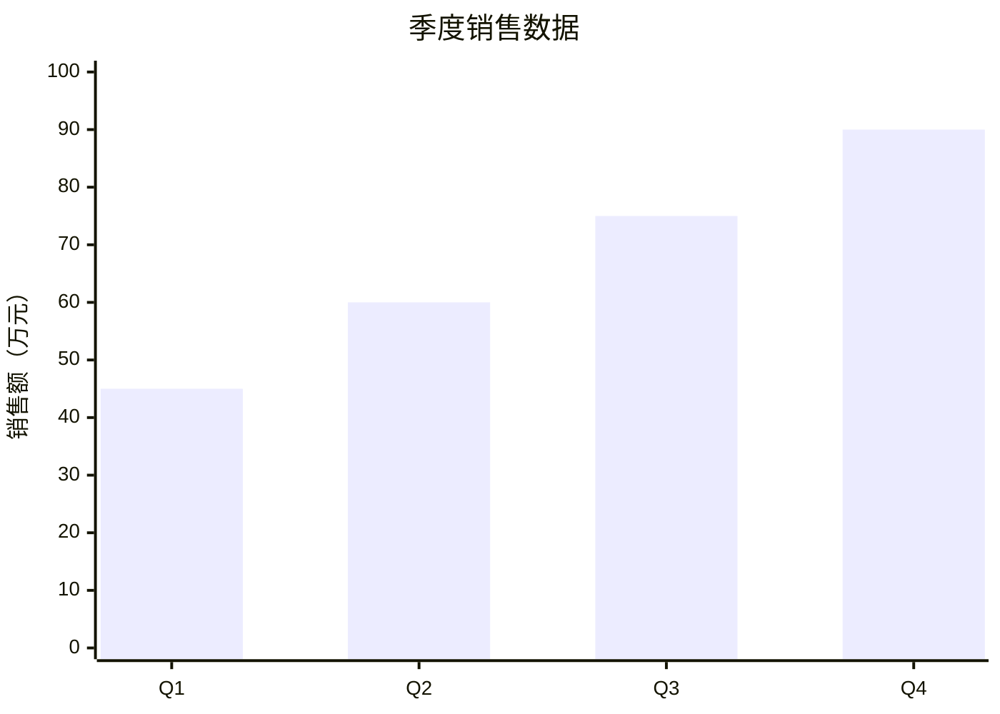
```mermaid
xychart-beta
    title "季度销售数据"
    x-axis ["Q1", "Q2", "Q3", "Q4"]
    y-axis "销售额（万元）" 0 --> 100
    bar [45, 60, 75, 90]
```

### 折线图
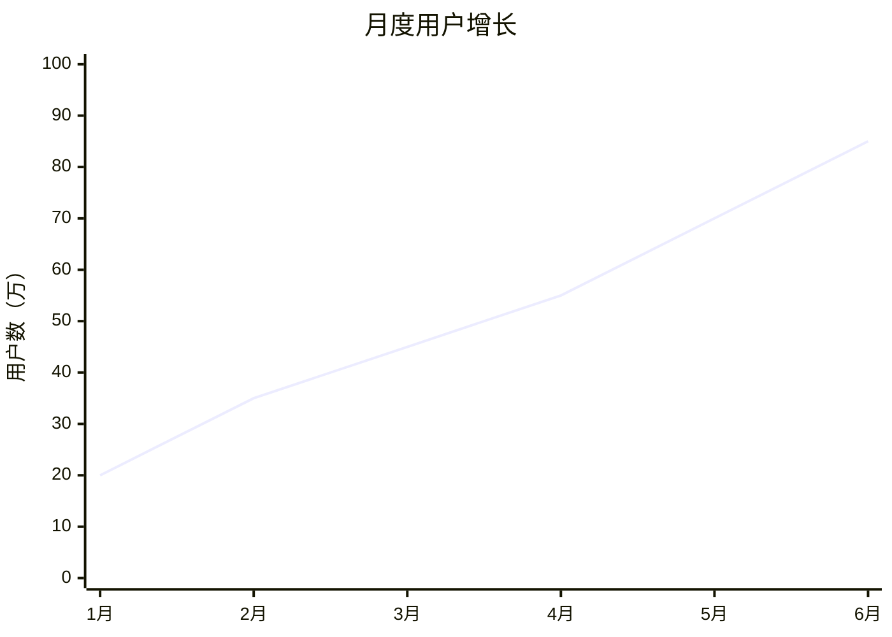
```mermaid
xychart-beta
    title "月度用户增长"
    x-axis ["1月", "2月", "3月", "4月", "5月", "6月"]
    y-axis "用户数（万）" 0 --> 100
    line [20, 35, 45, 55, 70, 85]
```

## 12. 需求图 (requirementDiagram)

适用于展示需求、需求之间的关系、需求与系统元素的关系。

```mermaid
requirementDiagram

    requirement 测试需求1 {
        id: 1
        text: 测试需求描述
        risk: 高
        verifymethod: 测试
    }

    requirement 测试需求2 {
        id: 2
        text: 测试需求描述2
        risk: 中
        verifymethod: 检查
    }

    element 测试实体 {
        type: 模块
    }

    测试实体 - satisfies -> 测试需求1
    测试需求1 - contains -> 测试需求2
```

### 需求图关系
- `- contains ->`：包含
- `- copies ->`：复制
- `- derives ->`：派生
- `- satisfies ->`：满足
- `- verifies ->`：验证
- `- refines ->`：细化
- `- traces ->`：追溯

## 13. C4架构图 (C4Context/C4Container/C4Component)

适用于展示系统架构、容器部署、组件设计等。

### 系统上下文图
```mermaid
C4Context
    title 系统上下文图 - 电商系统

    Person(user, "用户", "系统使用者")
    System(system, "电商系统", "提供商品浏览、下单、支付功能")
    System_Ext(payment, "支付系统", "第三方支付平台")
    System_Ext(logistics, "物流系统", "第三方物流平台")

    Rel(user, system, "使用")
    Rel(system, payment, "调用支付接口")
    Rel(system, logistics, "调用物流接口")
```

### 容器图
```mermaid
C4Container
    title 容器图 - 电商系统

    Person(user, "用户", "系统使用者")

    Container(webApp, "Web应用", "Vue.js", "提供用户界面")
    Container(apiGateway, "API网关", "Nginx", "请求路由与鉴权")
    Container(businessService, "业务服务", "Python/FastAPI", "处理业务逻辑")
    ContainerDb(database, "数据库", "MySQL", "存储业务数据")
    ContainerDb(cache, "缓存", "Redis", "存储热点数据")

    Rel(user, webApp, "访问")
    Rel(webApp, apiGateway, "API调用")
    Rel(apiGateway, businessService, "路由请求")
    Rel(businessService, database, "读写数据")
    Rel(businessService, cache, "读写缓存")
```

## 14. 架构图 (architecture-beta)

适用于展示系统架构部署关系。

```mermaid
architecture-beta
    group frontend(cloud)[前端]
    service web(server)[Web服务器] in frontend
    service cdn(network)[CDN] in frontend

    group backend(cloud)[后端]
    service api(server)[API服务] in backend
    service worker(server)[任务服务] in backend

    group data(cloud)[数据层]
    service db(database)[数据库] in data
    service cache(database)[缓存] in data

    web:R --> L:api
    api:R --> L:db
    api:T --> B:cache
    worker:R --> L:db
```

## 最佳实践

### 1. 图表选择建议
- **流程类**：flowchart（业务流程）、sequenceDiagram（交互流程）
- **结构类**：classDiagram（类结构）、erDiagram（数据结构）
- **状态类**：stateDiagram-v2（状态转换）
- **时间类**：gantt（项目计划）、journey（用户旅程）
- **数据类**：pie（占比）、xychart-beta（趋势）
- **架构类**：C4Context/C4Container（系统架构）、architecture-beta（部署架构）

### 2. 样式定制
- 使用 `style` 语法自定义节点样式
- 使用 `classDef` 定义样式类
- 颜色使用十六进制格式

```mermaid
flowchart TD
    A[开始] --> B{判断}
    B -->|是| C[处理]
    B -->|否| D[跳过]

    classDef success fill:#90EE90,stroke:#008000
    classDef warning fill:#FFD700,stroke:#FF8C00
    class C success
    class D warning
```

### 3. 使用建议
1. 避免图表过于复杂，节点数量建议控制在 20 个以内
2. 合理使用子图（subgraph）组织复杂结构
3. 图表布局优先使用 `TD`（自上而下）或 `LR`（从左到右）
4. 文字内容使用中文，确保用户友好
5. 图表代码后必须提供文字说明

## 注意事项

1. **语法正确性**：确保 Mermaid 语法正确，否则前端无法渲染
2. **中文支持**：所有节点、标签、说明文字使用中文
3. **代码块标记**：必须使用 `mermaid` 作为代码块语言标记
4. **避免特殊字符**：节点文本中避免使用 `()`、`{}`、`[]` 等特殊字符，如需使用请用引号包裹
5. **节点ID**：节点ID使用英文或拼音，不要使用中文（文本内容可以使用中文）
